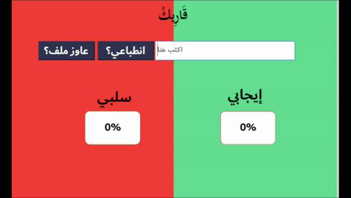

# Qarek: Arabic Sentiment Analysis Tool
`Qarek` is a state-of-the-art sentiment analyzer designed specifically for Arabic language text. With `Qarek`, you can easily analyze the sentiment of any Arabic text and get insights into the emotional tone of the content. Whether you're a business owner looking to monitor customer feedback or a researcher studying public opinion, `Qarek` can help you understand the sentiment behind Arabic language text. The demo allows users to input Arabic text, and `Qarek` will quickly analyze and classify the sentiment as positive, negative, or neutral. The user can also view detailed sentiment analysis results, including sentiment score, `Qarek` is easy to use, accurate, and reliable, making it an essential tool for anyone working with Arabic language text data.

  

# Installation
1. First `download` the demo from that link                         
 https://drive.google.com/file/d/1BlfkV2wVd96aa72xnCqTgIMxO4UU6HIL/view 
2. Dependencies      
* To `install` the required libraries for the `demo`:
1. Download `Dependencies.bat` from above  
2. Run
4. Replace the file called camel_tools in your PC with in this path "C:\Users\YOUR_USER_NAME\AppData\Roaming "  https://drive.google.com/file/d/1fRwFqEpXsJUzFINzwxxbwL_80c1mTPql/view?usp=share_link     
   
                                                  

3. Enjoy :)
# How to use?
* Watch our video demo here:      https://drive.google.com/file/d/11Gd11dVkHHSYUwjIOcPF4nUuGTDq16Nx/view?usp=drive_link    
* To determine the sentiment of a sentence or paragraph, input the text into the designated field and then click the `انطباعي` button.    
* To determine the sentiment of a file containing multiple sentences, click the `عاوز ملف` button and choose your desired file.
* To determine the sentiment of a particular word in a blog , input click the `بحث وانطباع` button then an input text field will appear, write the desired word in the input field. and provide the blog text in another the input field.
# The dataset used in the analysis
https://drive.google.com/drive/folders/1FD07FkOHZ0HkxAdUYxaped2P696Br53R?usp=share_link
# License
Made with ❤️ by      
* MOHAMED AHMED ABDEL FATTAH
* YOUSSEF HAMADA IBRAHIM
* MOHAMED GHAREEB MOHAMED   
                                                  
                                                  
Supervisor   
* Dr. Azaa Taha
                                             

