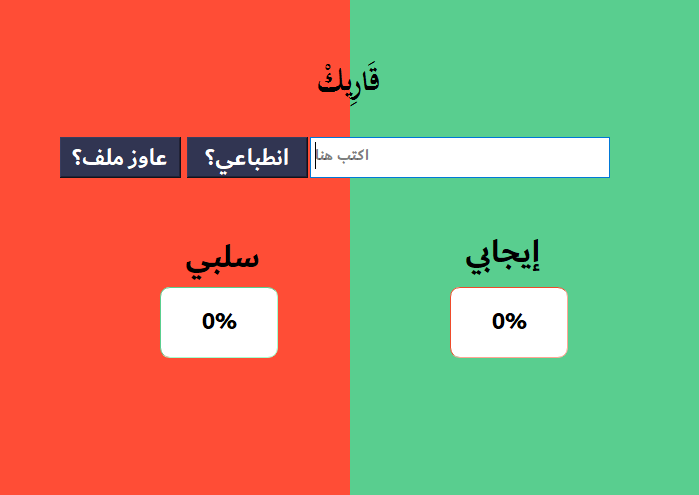

# Qarek: Arabic Sentiment Analysis Tool
`Qarek` is a state-of-the-art sentiment analyzer designed specifically for Arabic language text. With `Qarek`, you can easily analyze the sentiment of any Arabic text and get insights into the emotional tone of the content. Whether you're a business owner looking to monitor customer feedback or a researcher studying public opinion, `Qarek` can help you understand the sentiment behind Arabic language text. The demo allows users to input Arabic text, and `Qarek` will quickly analyze and classify the sentiment as positive, negative, or neutral. The user can also view detailed sentiment analysis results, including sentiment score, `Qarek` is easy to use, accurate, and reliable, making it an essential tool for anyone working with Arabic language text data.


# Installation
1. First dowmload the demo from that link                     
* https://drive.google.com/file/d/1zObUmGhdijFBsiX0o4AYImsWOrwRaVZa/view?usp=sharing   
2. Dependencies      
* To install the required libraries for the `demo`:
1. Dowmload `Dependencies.txt`
2. Run
```c
pip install -r requirements.txt
```
3. Enjoy
# How to use?
* Watch our video demo here: https://drive.google.com/file/d/1BAxq8-hsrNNPM_SmXcmLaCivxaG-_B9M/view?usp=sharing
# The dataset used in the analysis
https://drive.google.com/drive/folders/1FD07FkOHZ0HkxAdUYxaped2P696Br53R?usp=share_link
# License
Made with ❤️ by      
* MOHAMED AHMED ABDEL FATTAH
* YOUSSEF HAMADA IBRAHIM
* MOHAMED GHAREEB MOHAMED 

